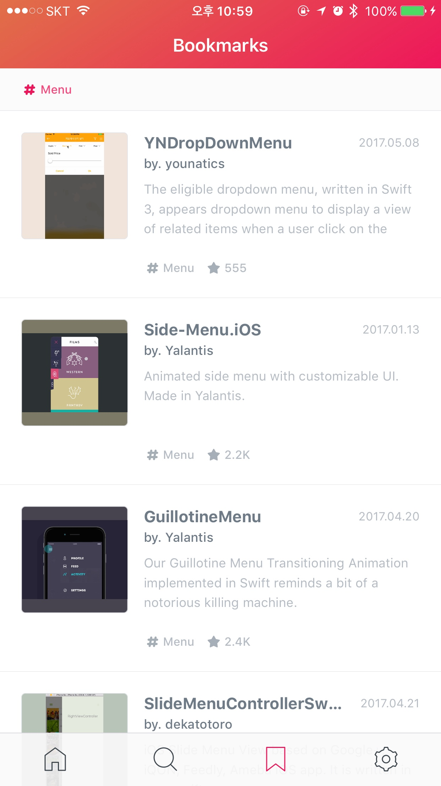

# PickColor
[](http://cocoapods.org/pods/PickColor)
[](https://github.com/Carthage/Carthage)
[](https://github.com/younatics/PickColor/blob/master/LICENSE)
[](https://travis-ci.org/younatics/PickColor)
[](http://cocoapods.org/pods/PickColor)
[](https://developer.apple.com/swift/)

## Intoduction
📌 Pick color in your image! It will magically return average color in your `UIImage`!. Also, you can get hexstring from `PickColor`




## Requirements

`PickColor` is written in Swift 3. Compatible with iOS 9.0+

## Installation

### Cocoapods

PickColor is available through [CocoaPods](http://cocoapods.org). To install
it, simply add the following line to your Podfile:

```ruby
pod 'PickColor'
```
### Carthage
```
github "younatics/PickColor"
```
## Usage
Get `UIColor`
```swift
UIImage.pickColor()
```

Get `HexSgtring`
```swift
UIImage.pickColorHexstring()
```

## References
#### Please tell me or make pull request if you use this library in your application :) 

## Author
[younatics 🇰🇷](http://younatics.github.io)

## License
PickColor is available under the MIT license. See the LICENSE file for more info.


