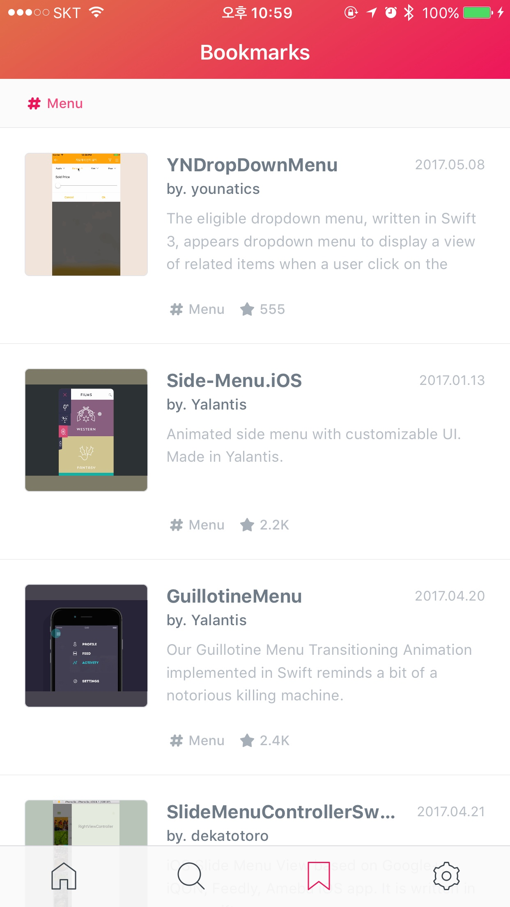

# PickColor
[](http://cocoapods.org/pods/PickColor)
[](https://github.com/Carthage/Carthage)
[](https://github.com/younatics/PickColor/blob/master/LICENSE)
[](https://travis-ci.org/younatics/PickColor)
[](http://cocoapods.org/pods/PickColor)
[](https://developer.apple.com/swift/)

## Intoduction
📌 Pick color in your image! It will magically return average color in your `UIImage`!. Also, you can get hexstring from `PickColor`




## Requirements

`PickColor` is written in Swift 6. Compatible with iOS 13.0+. Supports Swift Package Manager, CocoaPods, and Carthage.

## Installation

### Swift Package Manager

In Xcode, choose **File ▸ Add Package Dependencies…** and enter:

```
https://github.com/younatics/PickColor.git
```

Or add it to your `Package.swift`:

```swift
dependencies: [
    .package(url: "https://github.com/younatics/PickColor.git", from: "1.0.0")
]
```

### Cocoapods

PickColor is available through [CocoaPods](http://cocoapods.org). To install
it, simply add the following line to your Podfile:

```ruby
pod 'PickColor'
```
### Carthage
```
github "younatics/PickColor"
```
## Usage
Get `UIColor`
```swift
let UIColor = UIImage.pickColor()
```

Get `HexString`
```swift
let UIColorHexString = UIImage.pickColorHexstring()
```

## References
#### Please tell me or make pull request if you use this library in your application :) 

## Author
[younatics](https://twitter.com/younatics)
<a href="http://twitter.com/younatics" target="_blank"></a>

## License
PickColor is available under the MIT license. See the LICENSE file for more info.


