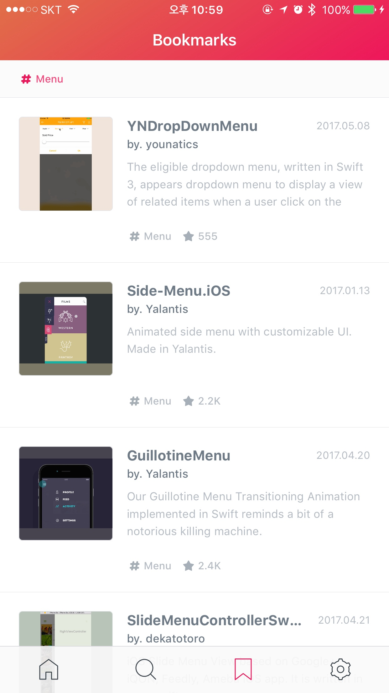

# PickColor
[](https://www.swift.org/package-manager/)
[](https://cocoapods.org/pods/PickColor)
[](https://developer.apple.com/ios/)
[](https://www.swift.org/)
[](LICENSE)

## Introduction
📌 Pick color in your image! It will magically return average color in your `UIImage`!. Also, you can get hexstring from `PickColor`




## Requirements

`PickColor` requires Swift 6 and iOS 13.0 or later. It supports Swift Package Manager and CocoaPods.

## Installation

### Swift Package Manager

In Xcode, choose **File ▸ Add Package Dependencies…** and enter:

```
https://github.com/younatics/PickColor.git
```

Or add it to your `Package.swift`:

```swift
dependencies: [
    .package(url: "https://github.com/younatics/PickColor.git", from: "1.0.0")
]
```

### CocoaPods

PickColor is available through [CocoaPods](http://cocoapods.org). To install
it, simply add the following line to your Podfile:

```ruby
pod 'PickColor', '1.0.0'
```

## Usage
Get `UIColor`
```swift
let image = UIImage(named: "example")!
let color = image.pickColor()
```

Get `HexString`
```swift
let image = UIImage(named: "example")!
let hexString = image.pickColorHexstring()
```

## References
#### Please tell me or make pull request if you use this library in your application :) 

## Author
[younatics](https://twitter.com/younatics)
<a href="http://twitter.com/younatics" target="_blank"></a>

## License
PickColor is available under the MIT license. See the LICENSE file for more info.
